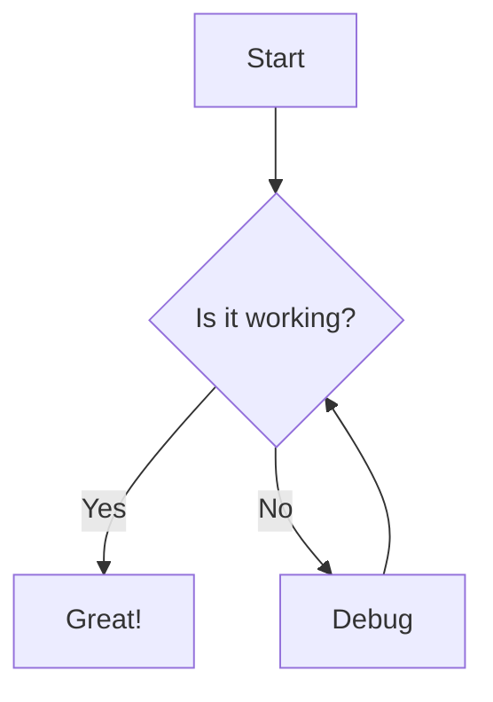
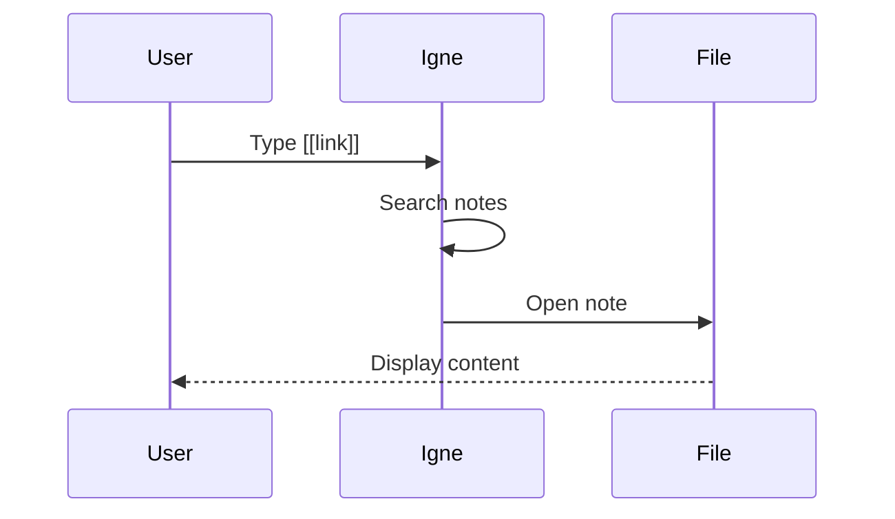
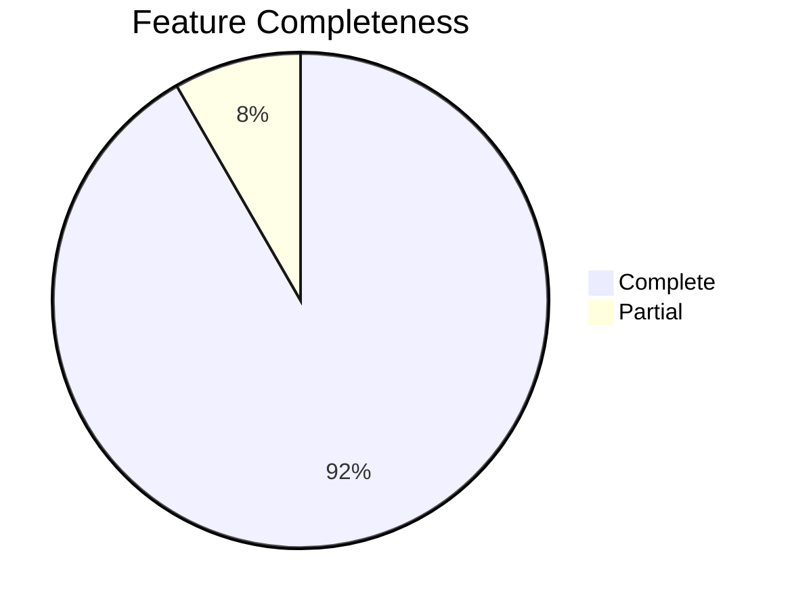

# Enhanced Markdown Features

This file demonstrates all of Igne's advanced markdown rendering capabilities.

---

## Math Rendering

Igne supports both inline and block math using KaTeX.

### Inline Math

The famous equation: $E = mc^2$

Greek letters: $\alpha, \beta, \gamma, \delta, \pi$

Complex fractions: $\frac{a}{b} = \sqrt{x^2 + y^2}$

### Block Math

The quadratic formula:

$$
x = \frac{-b \pm \sqrt{b^2 - 4ac}}{2a}
$$

Maxwell's equations:

$$
\begin{aligned}
\nabla \times \vec{E} &= -\frac{\partial \vec{B}}{\partial t} \\
\nabla \times \vec{H} &= \vec{J} + \frac{\partial \vec{D}}{\partial t}
\end{aligned}
$$

---

## Mermaid Diagrams

Igne renders Mermaid diagrams automatically.

### Flowchart



### Sequence Diagram



### Pie Chart



---

## Callouts

Igne supports Obsidian-style callouts with 12+ types.

### Info Callout

> [!INFO] Important Information
> This is an info callout. Use it for general information.

### Tip Callout

> [!TIP] Pro Tip
> Use keyboard shortcuts to work faster! Press `Cmd+P` to open command palette.

### Warning Callout

> [!WARNING] Be Careful
> This operation cannot be undone. Make sure to backup your data.

### Success Callout

> [!SUCCESS] Well Done!
> You've successfully created a callout.

### Question Callout

> [!QUESTION] Quiz Time
> What's the shortcut for daily notes? Answer: `Cmd+D`

### Quote Callout

> [!QUOTE] Inspiration
> "The best way to predict the future is to create it." - Peter Drucker

### Example Callout

> [!EXAMPLE] Code Example
> ```js
> console.log("Hello, Igne!");
> ```

### Collapsed by Default

> [!TIP]- Click to expand
> This content is hidden by default. Click the header to show it.

### Expanded by Default

> [!TIP]+ Always Expanded
> This content is always visible, even if you click to collapse.

---

## Footnotes

You can use footnotes[^1] to add references without cluttering the main text.

Footnotes are automatically numbered and linked. Click the number to jump to the footnote definition.

You can have multiple footnotes[^2] in a single document.

### Reference Section

[^1]: This is the first footnote. It can contain any markdown.
[^2]: This is the second footnote. Notice how the numbers are automatic.

---

## Definition Lists

Igne supports definition lists for glossaries and key-value pairs.

Term 1
: Definition 1

Term 2
: Definition 2a
: Definition 2b

### Example: Markdown Syntax

**Bold**
: Text surrounded by double asterisks

**Italic**
: Text surrounded by single asterisks

**Code**
: Text in backticks

---

## Task Lists

Interactive checkboxes that sync when you click them.

### Today's Tasks

- [x] Create test vault
- [x] Add markdown examples
- [ ] Test all features
- [ ] Write documentation

### Project Checklist

- [ ] Setup project
- [ ] Implement features
- [ ] Write tests
- [ ] Deploy to production

---

## Highlights & Strikethrough

You can ==highlight important text== with double equals.

And ~~strikethrough deleted text~~ with double tildes.

Combine them: ==**important and deleted**~~

---

## Tables

Basic GFM table support:

| Feature | Status | Notes |
|---------|--------|-------|
| Math | ✅ Complete | KaTeX integration |
| Mermaid | ✅ Complete | Async loading |
| Callouts | ✅ Complete | 12+ types |
| Footnotes | ✅ Complete | Click navigation |

---

**🎉 All markdown features working perfectly!**
